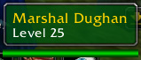
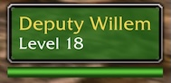

# ClassicTooltip

Brings back the circa-1.0 unit tooltip style.

## What it does

Modern tooltips color the unit's name and pack in a lot of extra detail.
ClassicTooltip goes the other way:

- The tooltip backdrop is tinted by reaction/hostility instead of the name.
- Player tooltips show three compact lines: name, "race class", and level.
- NPC tooltips show name, description (when there is one), and level, with
  the classic "+" after the level for elites. No city association, no PvP
  text.
- The health bar still shows for valid units and hides with the tooltip.

|  |  |

## Configuration

Open Settings (Esc > Options) and find ClassicTooltip in the AddOns list,
or type /ct (or /classictooltip) in chat.

- Use Classic tooltips (on by default)
- Display guild name (off by default) — shows \<Guild\> on player tooltips

## Installation

Copy the ClassicTooltip folder into
`World of Warcraft/_classic_/Interface/AddOns` (or the equivalent folder
for your Classic client), then enable it on the character select AddOns
screen.

## Compatibility

Supports Mists of Pandaria Classic, Classic Era and Forever. Item, spell, and
other non-unit tooltips are left completely untouched.
